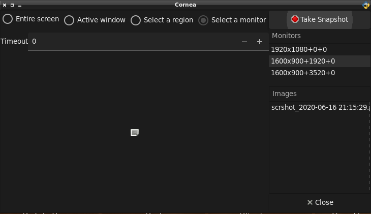

# Cornea
Cornea is a Python + Gtk application to take screenshots.

# Notes
* Need python 2+
* ```sudo apt-get install python3.8 python3-gi python3-setproctitle python-pyscreenshot```


# Images


# TODO
* Create OCR feature...
